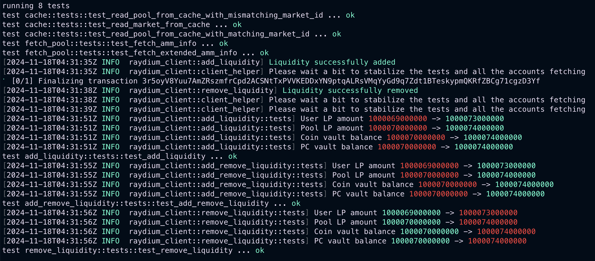
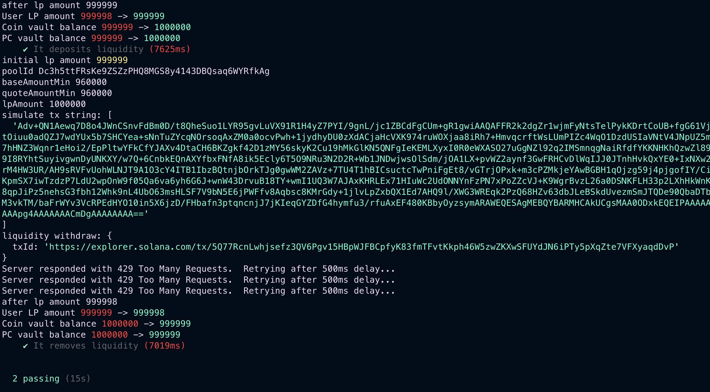

# Raydium Puppet

# ⚠️ Warning
- `./testing_keys/` are just convenience mints for testing, pls generate your own stuff (and don't commit it :>)


# 🍭 Features 

### 📜 TS Client
`./tests`
- [x] Create Market
- [x] Create Pool
- [x] Add Liquidity
- [x] Remove Liquidity
- [ ] Add and Remove Liquidity in one Transaction

### 🦀 Rust Client 
`./client`
- [ ] Create Market
- [ ] Create Pool
- [x] Add Liquidity
- [x] Remove Liquidity
- [x] Add and Remove Liquidity in one Transaction

### ⚓️ Program
- Maybe later.

---

# 🧪 Tests 


### DevNet SOL
You don't need much more than 2000 lamports to run the tests.
If you intend to create your own market and pool you will need much more though:
```
cargo install devnet-pow
devnet-pow mine
```

### Rust Client Tests
```
cargo test
```



### Typescript Tests
```
anchor test
```


---

# 🙋‍♀️ Pools for dummies 

### Add liquidity
- input: a pair of coins, (mintA,mintB)
- output: a liquidity provider coin 'mintLP'

You provide liquidity as a pair of coin, in exchange the pool mints a liquidity provider coin to you. You need to make sure that you have enough of each coin to provide liquidity.

### Remove liquidity
- input: a liquidity provider coin 'mintLP'
- output: a pair of coins (mintA,mintB)

You burn the liquidity provider coin, and the pool returns the pair of coins representing that liquidity.

Everything in between is just computing program derived addresses, creating or getting associated accounts. Verifying owners, calculating ratio and slippage. The primary difficulty comes from reproducability and having to recreate the whole state of the programs you interact with.

## Slippage
Slippage happens when you remove liquidity. The pool has to distribute the coins back to you, and the ratio has changed. How is that possible? It happens if someone else is adding or removing liquidity in between your transaction. The ratio changes, so you get less or more than expected.

As a user have you ever wondered why you get less than expected when you remove liquidity? Now you know!